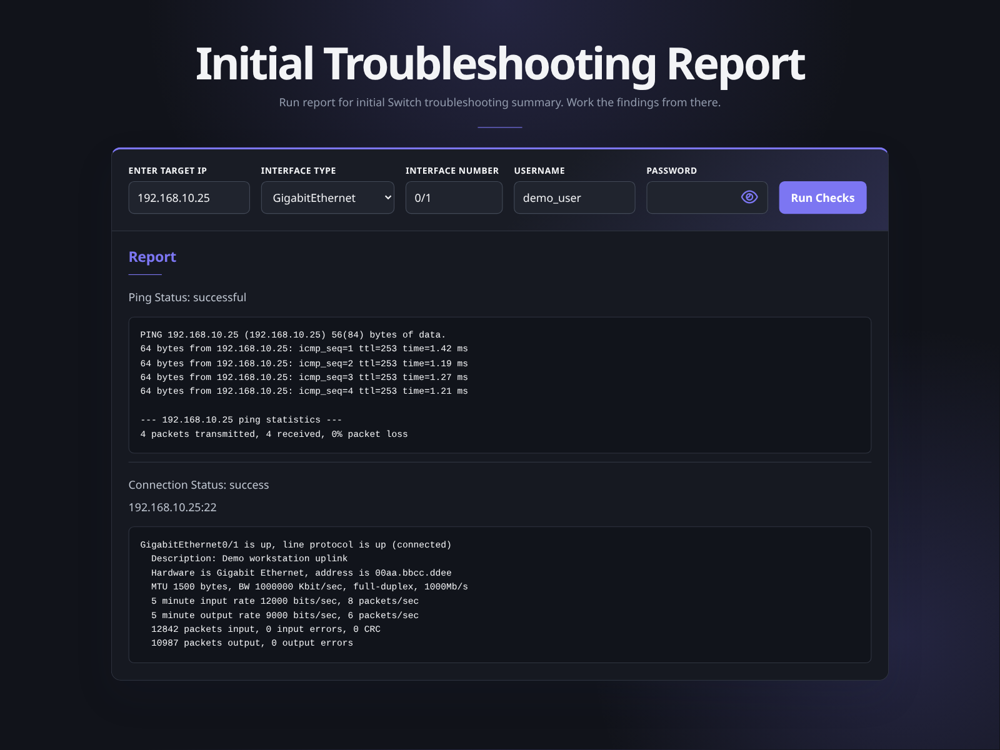
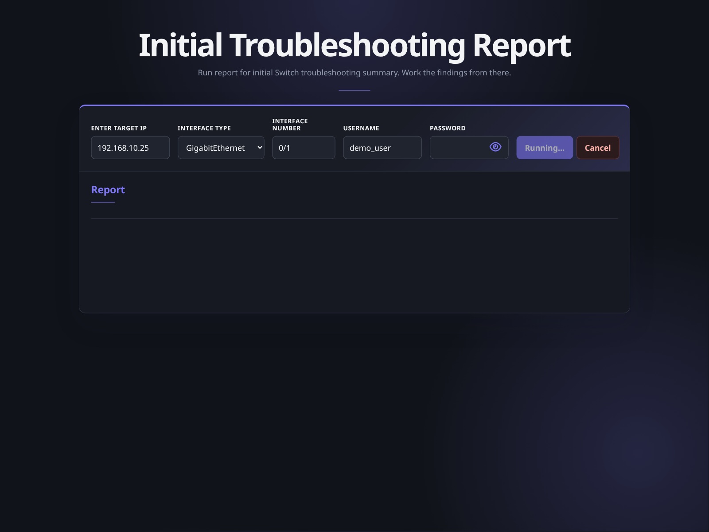
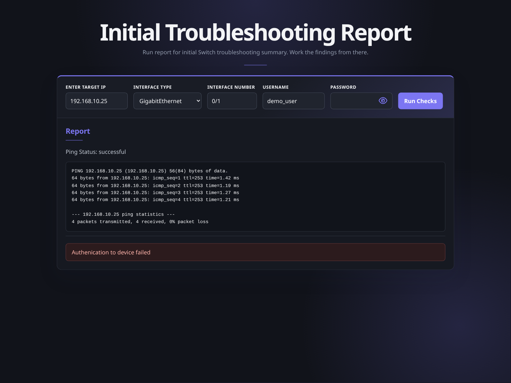

# Initial Troubleshooting Report

A small network troubleshooting prototype built with React and FastAPI. It runs ping and Cisco IOS interface checks, then displays the raw results in a browser.

This prototype is no longer under active development as the project is moving in a new direction.

## Screenshots

### Successful report



### Running checks



### Authentication failure



## Built With

- React and Vite
- FastAPI
- Netmiko
- Python `ping`

## Run Locally

Start the backend:

```bash
cd backend
source .venv/bin/activate
fastapi dev api.py
```

Start the frontend in another terminal:

```bash
cd frontend
cp .env.example .env
npm install
npm run dev
```

Open `http://localhost:5173`.
